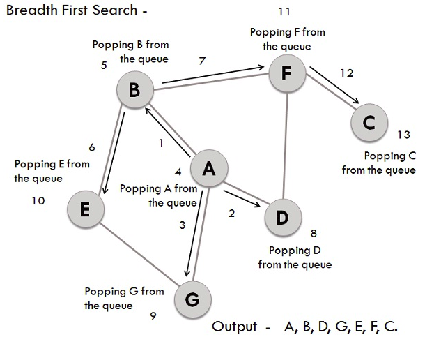
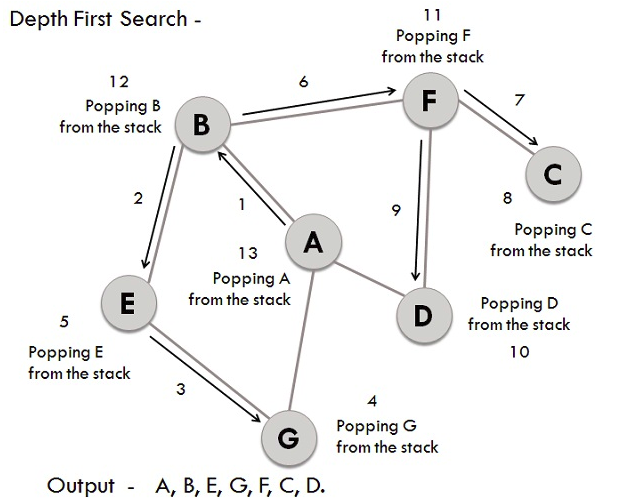

### Differences between BFS and DFS

**Key differences between BFS and DFS**

  -  BFS is a vertex-based algorithm while DFS is an edge-based algorithm.
  -  Queue data structure is used in BFS. On the other hand, DFS uses stack or recursion.
  -  Memory space is efficiently utilized in DFS while space utilization in BFS is not effective.
  -  BFS is an optimal algorithm while DFS is not optimal.
  -  DFS constructs narrow and long trees whereas BFS constructs wide and short trees.

### BFS traversal on example graph
  -  We have a graph whose vertices are A, B, C, D, E, F, G. Considering A as the starting point, the steps involved in the process are:
  -  Vertex A is expanded and stored in the queue.
  -  Vertices B, D, and G, as successors of A, are expanded and stored in the queue. Meanwhile, Vertex A is removed.
  -  Now B at the front end of the queue is removed along with storing its successor vertices E and F.
  -  Vertex D at the front end of the queue is removed, and its connected node F has already been visited.
  -  Vertex G is removed from the queue, and it has successor E which has already been visited.
  -  Now E and F are removed from the queue, and its successor vertex C is traversed and stored in the queue.
  -  At last C is also removed and the queue is now empty which means we are done.
  -  The generated Output is – A, B, D, G, E, F, C.

  

### DFS traversal on example graph

Similar to BFS lets take the same graph for performing DFS operations. The steps involved in the process are:

   - Considering A as the starting vertex which is explored and stored in the stack.
   - B, the successor vertex of A, is stored in the stack.
   - Vertex B has two successors E and F, among them alphabetically E is explored first and stored in the stack.
   - The successor of vertex E, i.e., G is stored in the stack.
   - Vertex G has two connected vertices, and both are already visited, so G is popped out from the stack.
   - Similarly, E is also removed.
   - Now vertex B is at the top of the stack, its other node(vertex) F is explored and stored in the stack.
   - Vertex F has two successors C and D, between which C is traversed first and stored in the stack.
   - Vertex C has only one predecessor which has already been visited, so it is removed from the stack.
   - Now vertex D which is connected to F is visited and stored in the stack.
   - Since vertex D does not have any unvisited nodes, D is therefore removed.
   - Similarly, F, B and A are also popped from the stack.
   - The generated output is – A, B, E, G, F, C, D.

   

